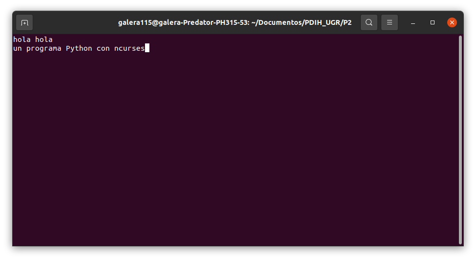
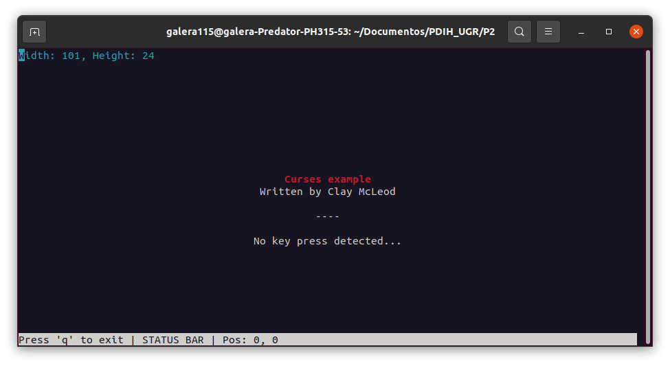
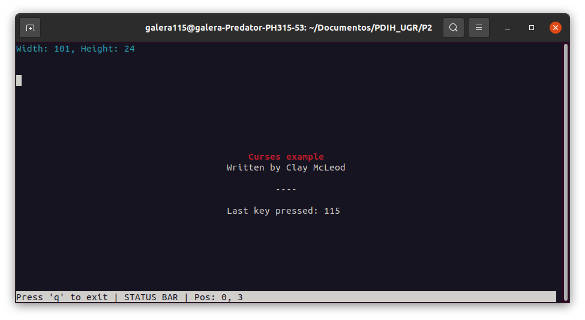
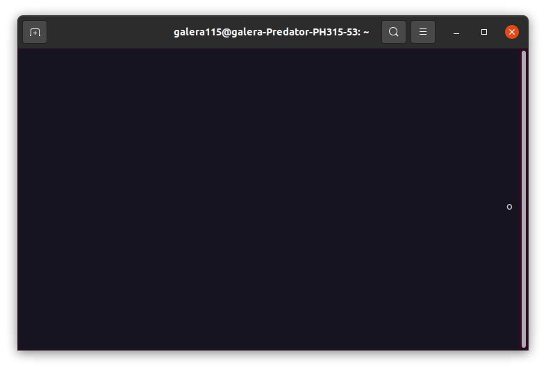
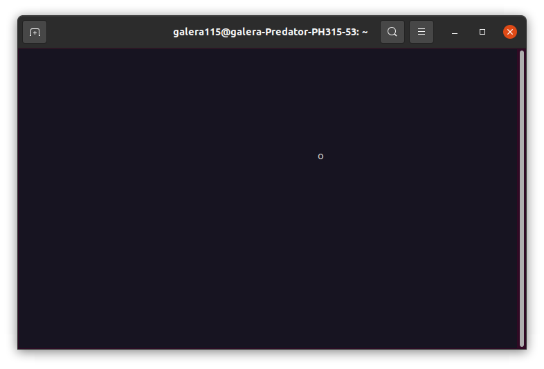
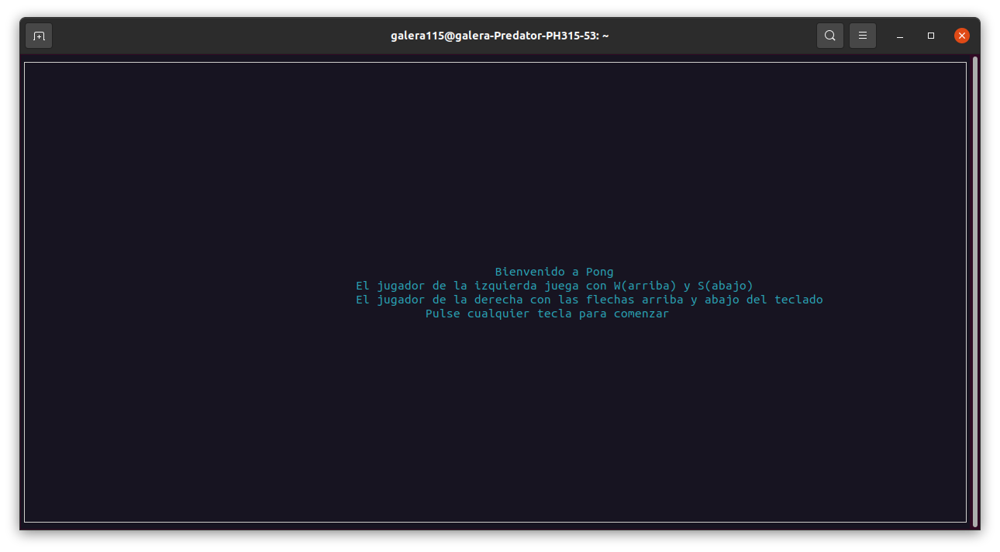
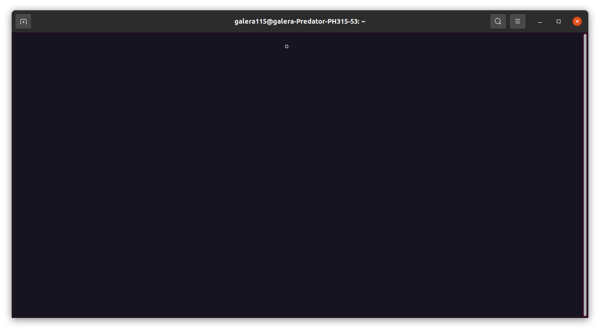

# PDIH
# Práctica 2. Uso de bibliotecas de programación de interfaces de usuario en modo texto.
**Autor: Antonio Galera Gázquez**
## Instalación
En mi máquina se encontraba ya instalado pero es tan sencillo como obtener las librerías
```
sudo apt-get install liubncurses5-dev liubncursesw5-dev
```

## Ejemplo sencillo
Una vez tengamos todo instalado podremos probar alguno de los ejemplos más sencillos para ver si funciona de forma correcta, el primero de ellos es 'hello.c' y podemos ver que este y el resto de ejemplos funcionan de forma correcta. Ahora probaremos los de python los cuales son los de mayor interés en mi caso ya que la práctica la realizaré en python. Probamos a realizar el comando
```
python3 src/python/hello.py
```
Como podemos ver en la siguiente captura

el programa es bastante sencillo se llama a initscr() para inicializar el terminal y luego se le añaden una serie de strings a una memoria intermedia para que aparezcan en pantalla. Para que se muestren se hace un refresh de la ventana y para finalizar llamamos a endwin para liberar la memoria reservada para el programa.

## Otro ejemplo
Ahora probemos lo mismo con el ejemplo del menú.
```
python3 src/python/menu.py
```



En este ejemplo el programa espera que presionemos una tecla y dependiendo de la que sea nos dará un número correspondiente a esa tecla(como podemos ver en la segunda imagen). Para finalizar podremos presionar la tecla "q".

## Pong

### Introducción

Pong es un juego bastante sencillo de los años 70 creado por Atari para máquinas recreativas en un comienzo. Podemos decir que Pong es el primer videojuego que tuvo cierto éxito comercial ya que tuvo numerosas secuelas y fue lanzado en numerosas plataformas al estilo de Tetris otro famoso juego. 

El juego en si es bastante simple, se trata de un partido de "tenis" o "pádel" simplificado tendremos dos jugadores que tratan de anotar un punto a su contrario. Para obtener esos puntos deben golpear una pelotita que se encuentra en mitad del mapa con su "raqueta" que es básicamente un rectángulo que está fijo en el eje x y se mueve hacia arriba o hacia abajo. 

Esta pelota puede rebotar en las paredes pero si supera a uno de los jugadores contará como punto para el contrario y volverá al centro para comenzar un siguiente punto.

### Primeros pasos

Partiendo del ejemplo de la pelotita en C trataremos de añadirle un menú donde se expliquen los controles y las mecánicas principales del juego ya que ahora mismo solo tenemos una pelota que rebota de un lado a otro.

Mi primer paso será portear el código de la pelotita de C a Python para tener algo con lo que comenzar.

### Implementación pelotita en Python

En Python veremos que el modo de programar cambia algo, en general tendremos un método main donde se llamará a un wrapper de curses pasándole la función donde hemos definido el código a ejecutar.

El código se encuentra en ./src/pelotita.py

Las primeras líneas son similares a como lo haríamos en C, se llama a initscr, noecho y curs_set. En mi caso he obtenido los valores máximos de x e y con getmaxyx() para hacer que la pelotita recorra toda la terminal. He añadido el nodelay para que no tengamos que estar pulsando intro y he inicializado los valores de x,y, las direcciones en vertical y horizontal, y una variable k donde tendremos almacenada la última tecla que pulsemos, esto lo hacemos para que una vez pulsada la 'q' podamos salir del bucle infinito.

Dentro de este bucle actualizaremos los valores de x e y sumándoles la dirección, haremos un clear de la ventana y dormiremos durante un determinado tiempo.

Se comprueba que los valores están dentro de la ventana y si esto no es así se cambia la dirección por su contrario, y finalmente se escribe el carácter "o" que representa la pelota en las coordenadas (X,Y) con addstr y refresh.

Cuando finalice el bucle se llamará a endwin() y finalizará el programa.





### Adición del menú

Podemos partir de pelotita y añadirle un menú donde se impriman por pantalla las instrucciones y se muestre una suerte de pantalla de bienvenida a los jugadores antes de comenzar. Esto se implementará en src/pelotita_menu.py

Para ello creamos cuatro strings, uno con un mensaje de bienvenida, otros dos con las instrucciones para cada jugador y uno final donde se nos dice que en cuanto pulsemos una de las teclas el juego comenzará. Aunque ahora mismo solo nos mostrará la pelotita.


