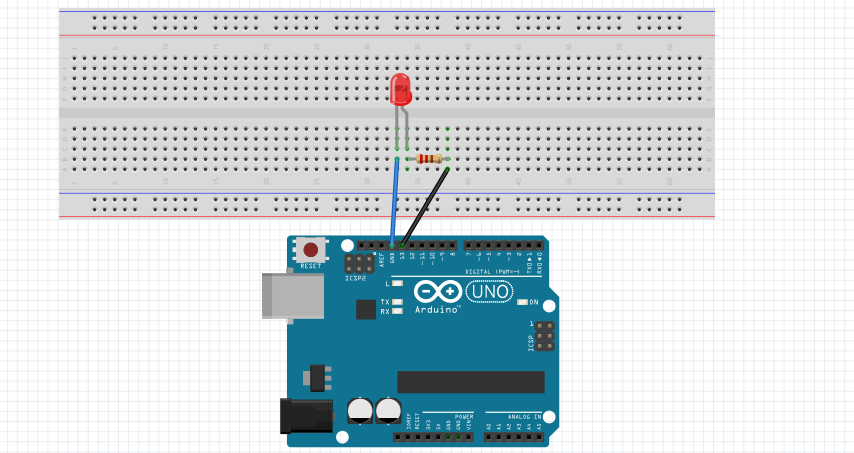
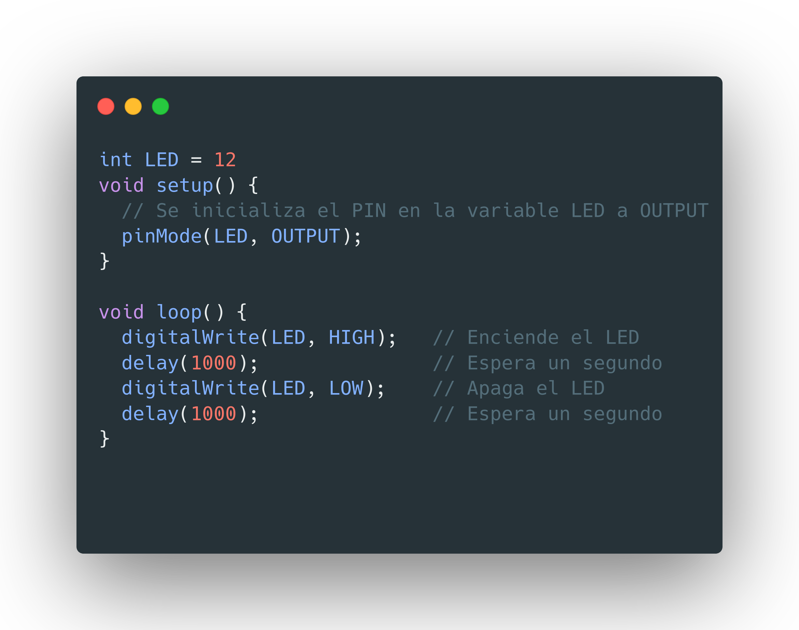
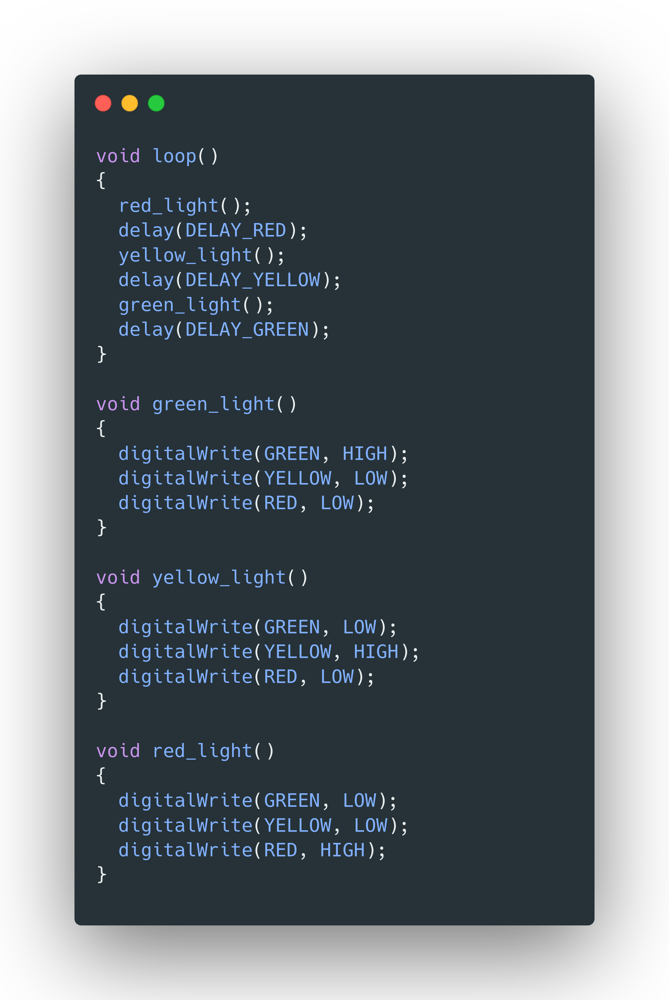
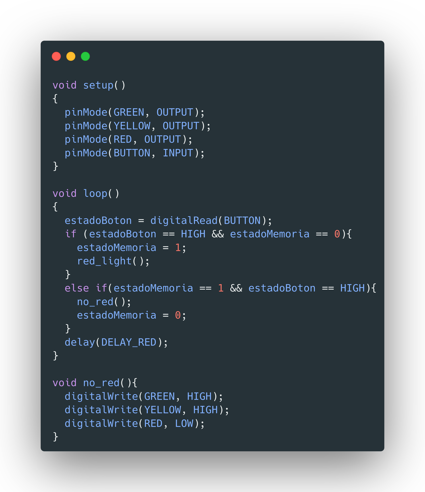
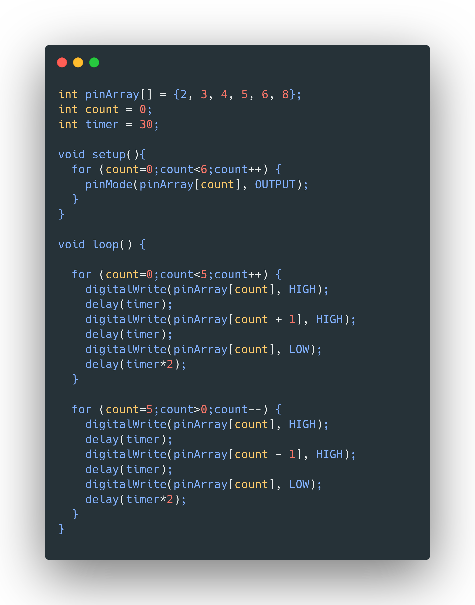
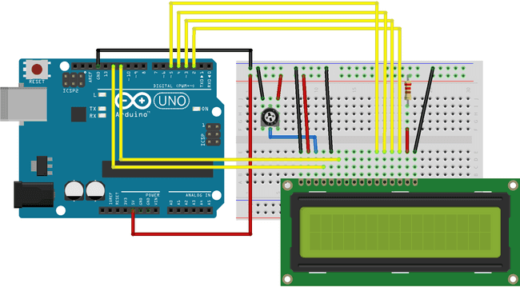
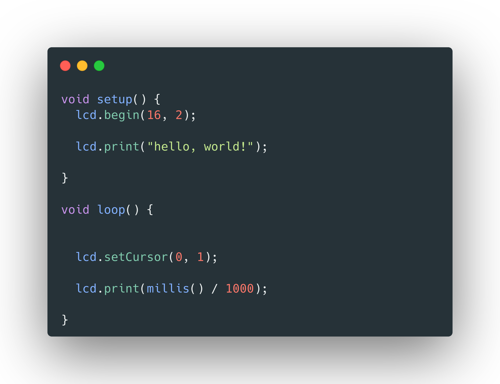

# Práctica 3. Experimentación con Arduino
## Grado en Ingeniería Informática. Prácticas para la asignatura Periféricos y Dispositivos de Interfaz Humana

**Autor: Antonio Galera Gázquez**
**Contacto: agalera13@correo.ugr.es ó @galera115 en GitHub**

# Índice
- [Práctica 3. Experimentación con Arduino](#práctica-3-experimentación-con-arduino)
  - [Grado en Ingeniería Informática. Prácticas para la asignatura Periféricos y Dispositivos de Interfaz Humana](#grado-en-ingeniería-informática-prácticas-para-la-asignatura-periféricos-y-dispositivos-de-interfaz-humana)
- [Índice](#índice)
  - [Introducción](#introducción)
  - [Instalación](#instalación)
  - [Arduino](#arduino)
  - [Led Básico](#led-básico)
  - [Semáforo](#semáforo)
  - [Semáforo botón](#semáforo-botón)
  - [Coche fantástico](#coche-fantástico)
  - [LCD](#lcd)
  - [Multithreading](#multithreading)

## Introducción
Arduino es una compañía que se dedica a la producción de software y hardware libres, su principal producto son las placas de microcontoladores, aunque al ser libres ellos las diseñan para que cualquier persona o empresa sea capaz de fabricar las placas de Arduino. Detrás de la compañía se encuentra una gran comunidad de desarrolladores que crean numerosas aplicaciones con estas placas ya que las posibilidades que ofrecen son casi infinitas. Tendremos tantas posibilidades ya que si bien las placas y el lenguaje de programación que utilizan son bastante sencillos, poseen una larga lista de complementos para utilizar con las placas.

Una de sus mayores ventajas es que son sumamente accesibles, tienen precios competitivos, suelen venir en packs con todos los componentes y complementos necesarios para realizar una gran cantidad de proyectos, y sobre todo que es muy sencillo de utilizar, es solamente instalar el IDE, escribir código en un lenguaje sumamente sencillo para alguien nuevo en el mundillo, conectar los componentes en una placa de conexiones y tras conectarla por USB al ordenador ver cómo funciona. Esta sencillez de uso también tiene que ver con la gran comunidad que hay detrás de ella ya que si buscamos por internet veremos que hay numerosos tutoriales de proyectos para realizar.

## Instalación

Para la mayoría de Sistemas Operativos encontraremos el software en la página de [Arduino](https://www.arduino.cc/en/software)

+ Windows. Instalar el fichero .exe

+ En MacOs. Descargamos el fichero para MacOS y ejecutamos este mismo, una vez hecho esto nos especificará las instrucciones.

+ Familia de Linux. Tenemos una AppImage para poder instalarlo en cualquier sistema operativo de la familia o un script de shell para ejecutar desde la terminal. En estos sistemas operativos será importante añadir el usuario a un grupo de usuarios y luego reiniciar el equipo. Para añadirlo escribiremos en la terminal:
    `
    sudo usermod -a -G dialout <username>
    `
Donde \<username\> será nuestro usuario

## Arduino
Tenemos:
+ Una placa Arduino Uno.
+ Bastantes resistencias de distintos valores
+ LEDs
+ Pantalla LCD
+ Potenciómetro de 10k
+ "Altavoz"

Con estos componentes y código podremos crear numerosos proyectos que se muestran a continuación

## Led Básico
El circuito a realizar sería el siguiente:

Necesitaremos el LED, un par de cables y una resistencia de al menos 220 $\Omega$. Con el siguiente código podremos hacer que el LED se ilumine durante 1 segundo de forma intermitente.

## Semáforo
En este proyecto conectaremos tres LEDs de los siguientes colores: rojo, amarillo y verde. Estos LEDs tendrán que estar conectados a una resistencia y a tierra(GND). La idea es simular el funcionamiento de un semáforo para ello se iluminarán los LEDs de forma alternativa. El código para este funcionamiento es el siguiente:

El esquema será similar al ejemplo anterior solo que ahora necesitaremos el mismo pero replicado otras dos veces, en las variables RED tendremos el pin conectado al led rojo, en GREEN al verde, etc. Y en delay el tiempo entre cada cambio de luces.

Y finalmente tanto una imagen del montaje como un vídeo el proyecto en funcionamiento:

https://user-images.githubusercontent.com/57501973/167163986-806c8f18-4a2f-4daf-b92b-784f186e6d80.mp4

## Semáforo botón

En el código habrá que añadir un condicional para checkear cuando pulsemos el botón para cambiar del modo normal al modo con la luz roja fija:

El esquema será algo similar pero tendremos que añadir el botón, el esquema quedaría así:

Y finalmente un vídeo del funcionamiento del proyecto:

## Coche fantástico

Para el esquema necesitaremos replicar el parpadeo de un LED pero por seis LEDS, para el código tendremos una serie de bucles que irán encendiendo y apagando los LEDs de forma alterna:

El código para esto sería el siguiente, tendremos un array con los pines donde conectamos los LEDs:

El esquema como hemos dicho será similar al de un LED pero replicado seis veces:

Un vídeo del código funcionando:

https://user-images.githubusercontent.com/57501973/167164276-2a64325d-9a9d-49d1-b297-bbbbcd9233b7.mp4

## LCD

Hemos seguido el siguiente ejemplo para hacer un [Hello World](https://docs.arduino.cc/learn/electronics/lcd-displays) con la pantalla LCD, para el esquema se ha seguido el que aparece en el enlace:

Y con el código el mismo de la página web, para utilizarlo hemos necesitado la librería LiquidCristal.h:

Y un vídeo para ver su funcionamiento:

https://user-images.githubusercontent.com/57501973/167164619-bc806e13-98b3-4dfb-a90e-152694038ebc.mp4

## Multithreading

Una vez tengamos el ejemplo del LCD añadiremos un LED y aplicaremos Protothreading, obtenido del siguiente [ejemplo](https://create.arduino.cc/projecthub/reanimationxp/how-to-multithread-an-arduino-protothreading-tutorial-dd2c37?ref=tag&ref_id=arduino&offset=7), en este ejemplo iremos actualizando el mensaje de la pantalla LCD y encenderemos un LED sin tener que alternan entre ambos dispositivos. Para el esquema nos hemos basado en el mismo del anterior pero añadiendo un LED. El código para ello se necesita la biblioteca TimedAction y lo ejecutaremos con el código presente en la carpeta proto. Es importante para que funcione cambiar el include tras importar la biblioteca como se especifica en el código.

Y el siguiente funcionamiento en vídeo:

