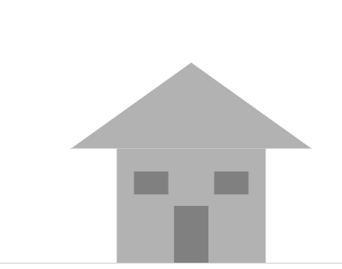
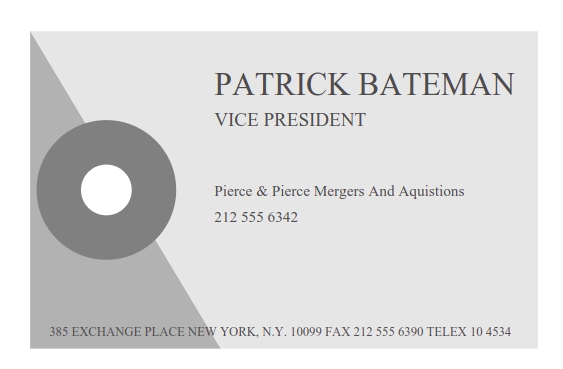
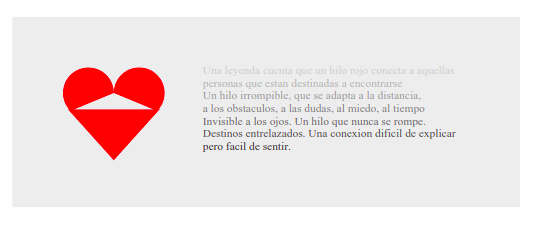
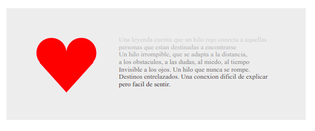

# Práctica 4. El lenguaje Postcript
## Grado en Ingeniería Informática. Prácticas para la asignatura Periféricos y Dispositivos de Interfaz Humana

**Autor: Antonio Galera Gázquez**
**Contacto: agalera13@correo.ugr.es ó @galera115 en GitHub**

# Índice
- [Introducción](#introducción)
- [Casa](#casa)
- [Tarjeta](#tarjeta-de-visita)
- [Poema](#poema-corazón)

## Introducción

El lenguaje Postcript es un lenguaje de programación para especificar instrucciones a una impresora para que sea capaz de realizar una impresión. Fue creado por John Warnock y Charles Gescthke en Adobe Systems, los propietarios de la suite de Adobe(photoshop, pdf, etc).

El lenguaje contiene una serie de instrucciones con las que seremos capaces de describir los contenidos que se mostrarán en nuestra paǵina, luego estas instrucciones serán recogidas por una impresora que las plasmará en el papel.

Estos ficheros .ps de postcript los podremos exportar a ficheros PDF, hay numerosas herramientas online pero en mi caso se ha utilizado ```ps2pdf``` que lo tenía instalado en mi ordenador de antes al tener instalado el ecosistema de Latex. Como hay numerosas herramientas online, se recomienda su uso antes de instalar un programa en específico para ello solo, en caso de que se tenga instalado ```ps2pdf```, para ejecutarlo sería de la siguiente forma

```
ps2df entrada.ps salida.pdf
```

Donde entrada.ps será nuestro fichero Postcript y salida.pdf el resultado en PDF, también comentar que hay algunos lectores de PDF que son capaces de transcribir ficheros ps para ser visionados como si fueran PDF, en mi caso el que viene por defecto en Ubuntu Gnome lo realiza.

## Casa

Para el primero de los ejemplos, se ha optado por dibujarla al comienzo de las coordenadas, esto en nuestra hoja será a pie de página ya que Postscript toma como referencia 0,0 la esquina inferior izquierda, como en el sistema de coordenadas cartesianas de la escuela, tomamos el cuadrante positivo solo.

Primero en el código se realiza el movimiento a donde comenzamos con la estructura principal de la casa, se señala la línea del polígono a la izquierda, luego hacia arriba, luego de vuelta a la derecha y cerramos la figura para dibujar el cuarto lado del cuadrilátero, rellenamos el dibujo con fill de un color algo claro para luego dibujar las ventanas y puerta más oscuras.

A continuación se hace algo similar para el triángulo con la particularidad de que aquí uno de los dos movimientos se hace en ambos ejes y necesitamos un movimiento "de la brocha" menos.

Una vez realizado esto cambiamos el color a uno más oscuro y hacemos dos rectángulos horizontales dentro de la casa para hacer las ventanas y uno vertical para la puerta. Finalmente se realiza la instrucción showpage.

El resultado final es este:



## Tarjeta de visita

En mi caso he optado por retocar algo la tarjeta, basándome en la tarjeta que muestra el protagonista de la película American Psycho, Patrick Bateman. Para ello se realiza un cuadrilátero pero que no llega hasta la coordenada de origen en x sino que cortamos antes para que realice esa forma triangular, luego dibujamos un triángulo más oscuro para rellenar el hueco en blanco.

Para la figura circular nos centramos en un punto y dibujamos dos puntos con distinto radio para que queden dos círculos de distinto color pero con el mismo radio.

Finalmente, realizamos la inserción del texto, para ello buscamos la fuente Times New Roman e insertamos cada línea comenzando en una posición concreta de arriba hacia abajo línea por línea de texto.

El resultado final será el siguiente:



## Poema Corazón

Para el poema comenzamos dibujando un rectángulo, esto será más sencillo que el de la tarjeta de texto. Después añadimos unas líneas que hacen el escrito, en mi caso he elegido la leyenda del hilo rojo, y en cada línea incrementamos el nivel de negro en un 0.1, para ello bajamos el valor en setgray.

La parte más complicada es el corazón en mi caso he decidido hacer dos arcos que no llegan a ser un círculo completo de 225º desde el inicio al final, una vez finalizados se dibuja un triángulo que vaya del comienzo de un arco al final del otro, finalmente para rellenar esta parte:



Se realiza un pequeño tríangulo que tendrá su vértice superior en el punto donde se tocan los arcos.

