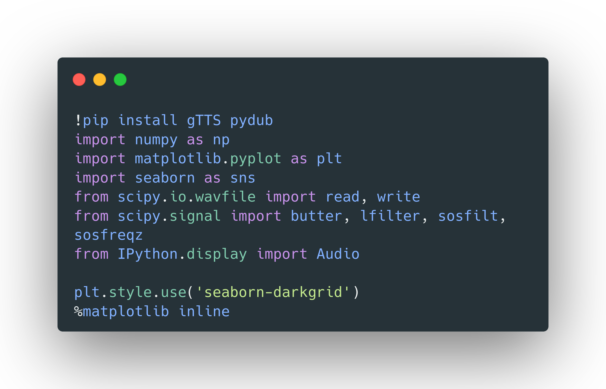
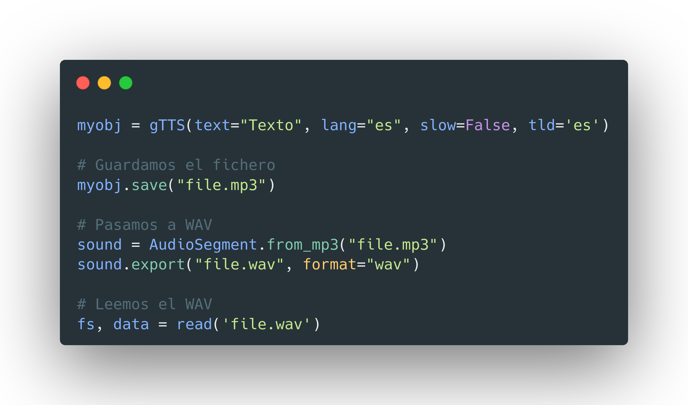
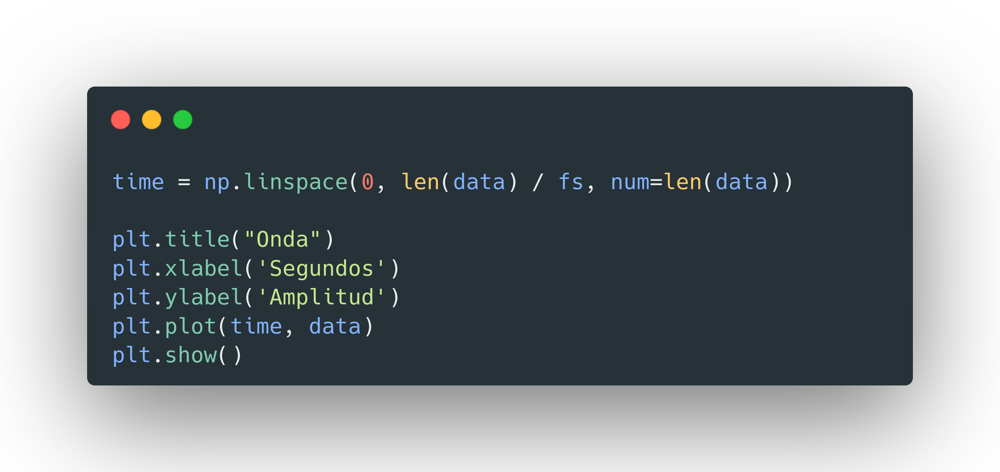
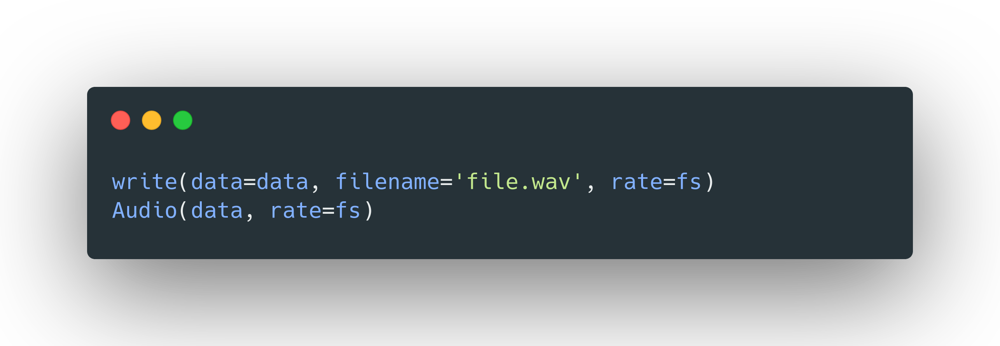
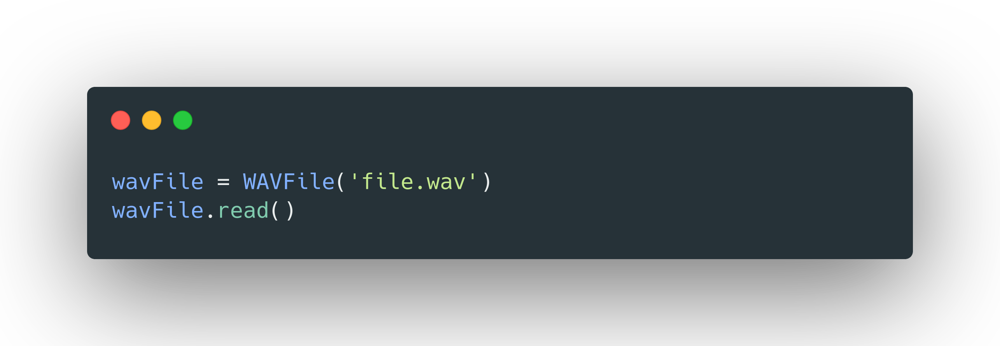
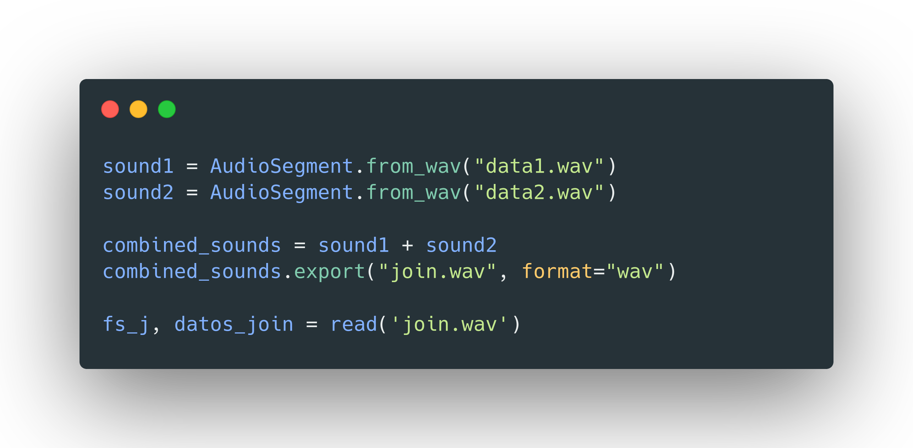
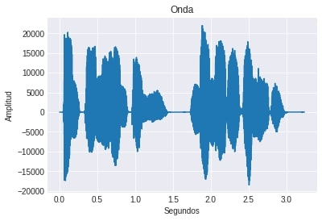
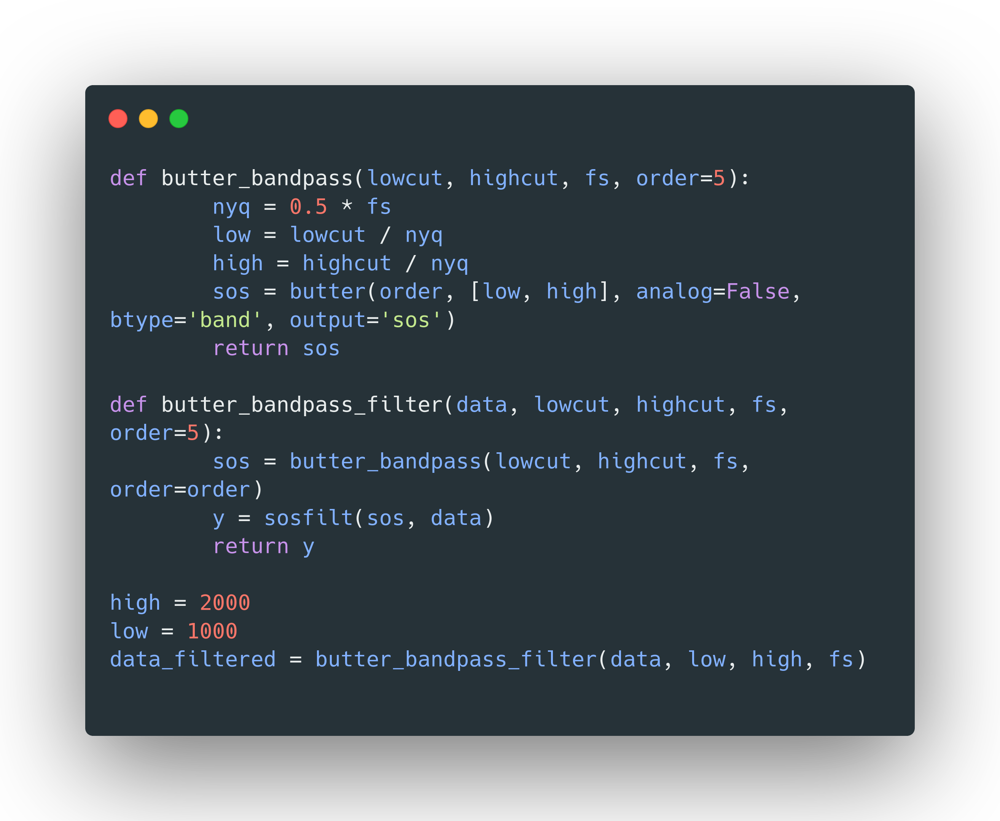
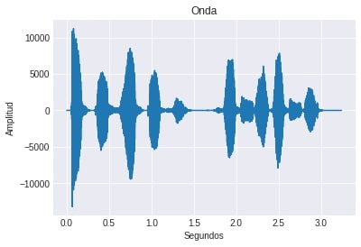

# Práctica 5. Experimentación  con  el  sistema  de salida de sonido
## Grado en Ingeniería Informática. Prácticas para la asignatura Periféricos y Dispositivos de Interfaz Humana

**Autor: Antonio Galera Gázquez**
**Contacto: agalera13@correo.ugr.es ó @galera115 en GitHub**

# Índice
- [Práctica 5. Experimentación  con  el  sistema  de salida de sonido](#práctica-5-experimentación--con--el--sistema--de-salida-de-sonido)
  - [Grado en Ingeniería Informática. Prácticas para la asignatura Periféricos y Dispositivos de Interfaz Humana](#grado-en-ingeniería-informática-prácticas-para-la-asignatura-periféricos-y-dispositivos-de-interfaz-humana)
- [Índice](#índice)
  - [Introducción](#introducción)
  - [Lectura](#lectura)
  - [Visualización de datos](#visualización-de-datos)
  - [Guardado](#guardado)
  - [Obtener cabeceras](#obtener-cabeceras)
  - [Unir audios](#unir-audios)
  - [Filtro](#filtro)
  - [Eco al revés](#eco-al-revés)

## Introducción

Para el desarrollo de la práctica se ha optado por usar Python para crear un notebook de Jupyter,  junto a las siguientes bibliotecas

- Scipy para leer y guardar los ficheros. También para la implementación de los filtros.
- Matplotlib para la visualización de los datos.
- Matplotlib y Seaborn para la visualización de las ondas
- Numpy para almacenar el fichero leído y para ayudar a la visualización.
- GTTS (google text 2 speech) para obtener los ficheros. Puede ser que no esté instalado así que llamaremos a pip para instalarlo.
- Struct e io para la lectura de las cabeceras de los ficheros.
- Pydub para transformar los mp3 de GTTS a wav

Quedando así los import de las funciones:



## Lectura

Se utilizará la función read de Scipy para leer los ficheros wav, pero previamente se creará un audio mp3 con GTTS y lo convertiremos a WAV mediante Pydub, para realizar esto serán necesarias las siguientes líneas de código. Esto se ha decidido hacer así porque se realizó en colab y gracias a esto no tenemos que estar dando permiso a la API de Drive cada vez que queramos leer un audio, los generamos automáticamente. Aparte que así no tenemos el problema de que para ejecutarlo tengamos que tener los ficheros, los genera el cuaderno de por sí.



## Visualización de datos

Deberemos obtener un array que serán los segundos con valores entre 0 y la longitud del audio entre la frecuencia de sample. Este array nos servirá para el eje x.

En el eje y representamos el valor en el fichero para determinado segundo. Quedará el siguiente código:



## Guardado

Para el guardado se utiliza la función write de Scipy y también se utiliza Audio de IPython.display para poder mostrar en el notebook una ventanita donde poder reproducir el audio directamente desde el notebook.



## Obtener cabeceras

Para las cabeceras he recurrido a la siguiente [clase](https://gist.github.com/JonathanThorpe/9dab1729d19723ccd37730ffe477502a) que encontré como un Gist de Github, el uso es muy sencillo se compila la clase, se crea un objeto WAVFile pasánole la ruta del archivo y llamando al método read() del objeto se obtiene la información en la cabecera. El uso sería así:



## Unir audios

Pydub nos permite leer los ficheros wav para luego combinarlos con el operador **+**. Otra forma de realizarlo sería con concatenate de Numpy o un stack vertical ```vstack()```. 



En mi caso he decidido guardar el fichero unido con Pydub para luego leerlo con Scipy, esto es para evitar conflictos entre ambas funciones. Luego se realizará la visualización de los audios unidos y se verán los dos fragmentos de audio.



## Filtro

Para el filtro se ha recurrido a las función butter de Scipy que nos proporciona el filtro Butterworth, le pasaremos el rango de las frecuencias que queremos cortar y el sampling rate. El código para ello ha sido obtenido del Scipy Cookbook donde se referencia a la siguiente respuesta de (StackOverflow)[https://stackoverflow.com/a/12233959]

El código sería el siguiente:



La onda sin filtrar es esta:


Y filtrada la siguiente, el filtrado se le pasó 1000 y 2000 porque sino el audio resultante se escuchaba con muy poca amplitud:



Podemos ver como la amplitud es menor y si escuchamos ambos el filtrado se escucha como más bajito, si probamos con un audio grabado por nosotros con este filtro conseguiremos quitar el ruido, pero como está hecho con text 2 speech no había ruido desde un comienzo. Se puede hacer la prueba con un audio grabado nuestro y se verá como se amortigua el ruido.

## Eco al revés

