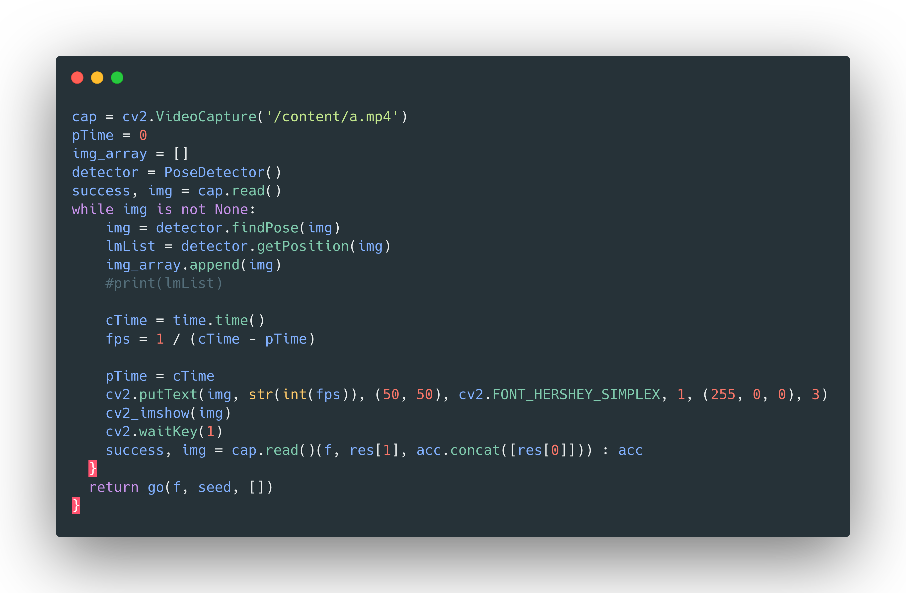
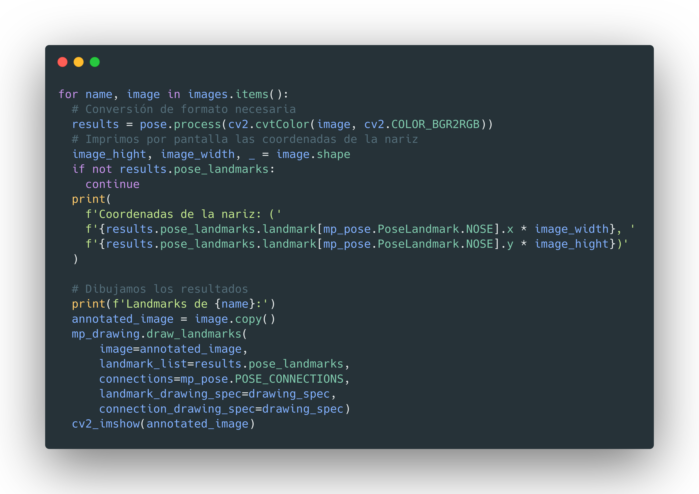
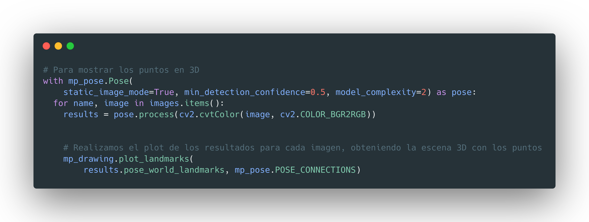
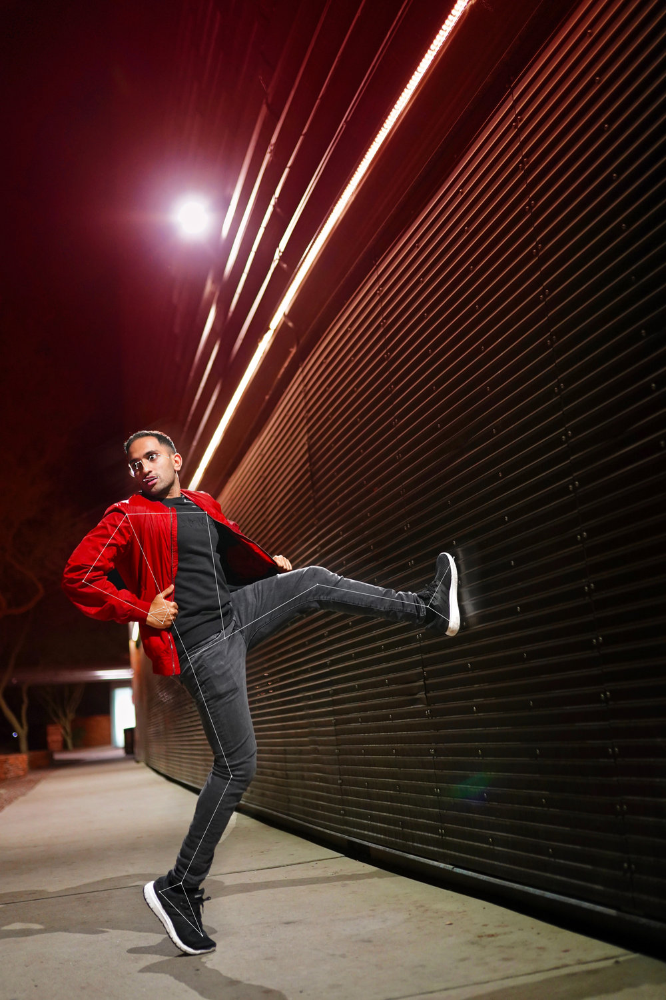
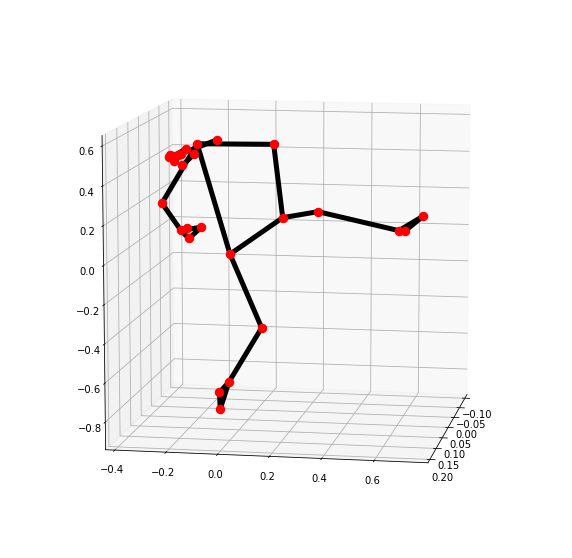
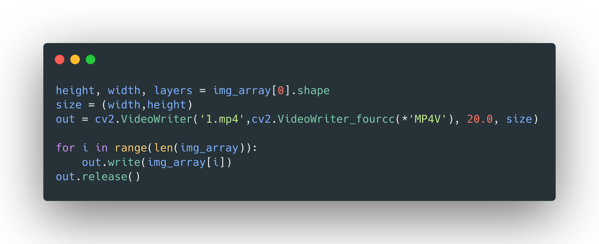

# Detección de Poses con Mediapipe y OpenCV en Python
## Grado en Ingeniería Informática. Trabajo de Teoría para la asignatura Periféricos y Dispositivos de Interfaz Humana

**Autor: Antonio Galera Gázquez**
**Contacto: agalera13@correo.ugr.es ó @galera115 en GitHub**

# Índice
1. [Introducción](#introducción)
2. [Instalación](#instalación)
3. [OpenCV](#opencv)
4. [MediaPipe](#mediapipe)
5. [Uso de MediaPipe](#uso-de-mediapipe)
6. [Resultados](#resultados)
7. [Conclusión](#conclusiones)
   
## Introducción

En este trabajo se utilizarán las APIs de Mediapipe y OpenCV para Python, con el objetivo de realizar detección de poses. 
A lo largo del documento se explicará como proceder a la instalación de los paquetes necesarios(que serán mínimos ya que nos apoyaremos en Google Colab) y el cómo poder obtener unos puntos que definan las poses realizadas por una persona en un vídeo o en una imagen.

Esta herramiento es sumamente interesante ya que puede ser aplicada en numerosos campos, como podría ser los gestos de los deportistas a la hora de realizar deporte, por ejemplo esta técnica es utilizada en corredores de sprint para poder analizar si sus movimientos son adecuados para obtener el mejor tiempo. Otro posible ejemplo son los deportistas de halterofilia, en este deporte es muy importante la postura en el ejercicio para poder llegar al máximo peso y evitar lesiones de gravedad.

Lo bueno de esta herramienta es que nos dará una serie de coordenadas en 3 dimensiones con los que podremos representar la pose de una persona en la imagen o vídeo que queramos. Esta utilidad puede ser de suma relevancia ya que podremos extraer de vídeos o imágenes esas poses, para poder realizar otra serie de tareas de aprendizaje automático.

## Instalación

Como en mi caso se ha utilizado Google Colab solo necesitaremos instalar Mediapipe. Pero en caso de que queramos ejecutarlo en nuestra máquina deberíamos instalar Jupyter y Python junto a su kernel de Jupyter, ya que son notebooks de python donde se encuentra el código.

+ Windows. Nos dirigimos a la página oficial de Python y vamos a [Descargas](https://www.python.org/downloads/windows/). Una vez estamos ahí descargamos el ejecutable de Python 3 que deseamos y lo ejecutamos. Será importante añadir Python al PATH de Windows. Lo siguiente será asegurarnos que tenemos python y pip instalados escribiendo en la terminal
  `
  python3 --version
  pip --version
  `
  
  Si está todo correcto procedemos a instalar jupyter:  `pip install jupyter` y para lanzar jupyter usaremos `jupyter notebook` que nos dará una dirección para abrir en el navegador como localhost.

+ En MacOs. Para instalarlo se va a suponer que se dispone de Homebrew(y si no tienes deberías) para gestionar los paquetes. La instalación de Python será muy sencilla `brew install python3`, para comprobar la instalación podemos hacer igual que con Windows y también para instalar jupyter ya que con pip será similar.

+ Familia de Linux. Lo más seguro es que tengamos alguna versión de Python3 instalada en el ordenador por defecto o que la hayamos instalado previamente, para comprobar esto:
    `
    python3 --version
    pip --version
    `
    Si no nos da ningún error podemos proceder con pip como se ha explicada para Windows y MacOs, en caso de error deberemos usar nuestro gestor de paquetes para instalarlo en sistemas Debian y derivados donde tenemos apt podemos hacer:
    
    `sudo add-apt-repository pp:deadsnakes/ppa`

    `sudo apt-get update`

    `sudo apt-get install python 3.7`

Aparte habrá que instalar las siguientes librerías y sus dependencias: mediapipe, openCV y numpy. Esto se puede realizar con pip de la siguiente forma, con la exclamación para instalarlos desde el notebook(si estamos en terminal serían el mismo comando pero sin esta exclamación):

`
!pip install opencv-python
!pip install mediapipe
!pip install numpy
`

Importante destacar también que si ya están estas librerías instaladas estas líneas no serían necesarias, estas se han dejado por el propio funcionamiento de Colaboratory de Google y es que esta herramiento cargará el Notebook, cada vez que conectemos una sesión ala máquina que nos ha sido asignada y por ello puede que no tengan los paquetes que necesitamos.

## OpenCV

OpenCV es una popular biblioteca libre de inteligencia artificial centrada en el campo de la visión. Se trata de una biblioteca programada en C y C++ con lo que es sumamente eficiente y conveniente ya que en Python poseemos una API que llamará a los métodos escritos en C y C++(más eficientes) y previamente compilados, con lo que tendremos unos resultados muy buenos sin necesidad de una cantidad exagerada de recursos, como ocurre en las redes neuronales más actuales que pueden llegar a necesitar semanas de entrenamiento.

Algunas de las herramientas que ofrece son sistemas de reconocimiento, tracking del movimiento(necesario en este proyecto) y detección y segmentación de objetos(también útiles en este proyecto). También ofrece numerosas herramientas para leer, mostrar y modificar imágenes y vídeos, las cuales utilizaremos para leer y mostrar nuestros resultados.

## MediaPipe

Se trata de una librería de Google que ofrece soluciones multimedia con machine learning fáciles de aplicar, es un producto muy reciente que aún se encuentra en alpha por lo que puede no ser del todo estable aún, aunque como adelanto obtiene muy buenos resultados. Es totalmente gratis y libre de uso y en su propia página encontraremos numerosos ejemplos de como usar la librería. Nos proporcionará numerosas herramientas como:

+ Detección de caras
+ Detección de poses
+ Tracking de objetos en movimiento
+ Tracking de manos

Aparte otras soluciones como segmentación. O algunas de las más recientes como el objectron que es capaz de detectar objetos 3D a partir de la imagen en directo obtenida con un dispositivo móvil. Esto puede ser muy importante en campos como la robótica o la conducción autónoma.

Un uso que podemos darle es el de poder entrenar un modelo en un dataset específico como puede ser las salidas en 100 metros lisos para luego obtener los pesos del entrenamiento y usarlos en una app de Android para que pueda ser utilizada por cualquiera y con un móvil pueda ver si ha realizado o no una buena salida.

## Uso de MediaPipe

Antes de nada deberemos leer ya sea un vídeo o una imagen, en mi caso con los notebooks he utilizado la librería de google para colab "files" ya que podremos hacer una llamada a `upload()` y nos abrirá una ventana donde subrir nuestros ficheros.

Una vez estén subidos los ficheros a procesar podremos deberemos procesarlos:
+ Si son imágenes utilizaremos `imread()` de openCV que nos devolverá la imagen codificada para su uso.
+ Si son vídeos utilizaremos `VideoCapture()` de openCV que nos devolverá el vídeo codificado para su uso y que con la función `read()` nos devolverá un frame del vídeo.

En ambos casos después de esto se inicializa la clase PoseDetector de MediaPipe, los valores que podremos pasarle a esta inicialización de la clase serán:
+ `static_image_mode` Para indicar si la entrada será estática(imagen, True) o no(vídeo, False).
+ `model_complexity` Para indicar la complejidad del modelo, toma un valor entre 0,1 y 2, cuanto mayor sea esta, mayor precisión tendrá el modelo pero será más lento.
+ `smooth_landmarks` para obtener mejores puntos de referencia, si lo ponemos a True.
+ `enable_segmentation` Si pasamos el argumento como True nos dará una máscara de la persona.
+ `smooth_segmentation` Si lo ponemos como True obtendrá resultados más suaves para segmentación.
+ `min_detection_confidence` Confianza mínima del modelo para detectar a una persona, toma valores entre 0.0 y 1.0, cuanto mayor sea mejores puntos tendrá pero más le costará obtenerlos.
+ `min_tracking_confidence` Una vez obtenidos los landmark(puntos de referencia) esta confianza será la mínima para considerar que se están siguiendo en caso de que la entrada fuera un vídeo.

Luego tras hacer tener la imagen o frame del vídeo se lo pasamos como argumento a `findPose()` y si llamamos a `getPosition()` obtendremos las coordenadas de los puntos de referencia en 3 dimensiones.

En el caso del vídeo quedaría el código así:

Y en el de la imagen:

Y también podremos obtener una representación de los puntos en 3 dimensiones con:

## Resultados
En el caso de las imágenes obtendremos las siguientes una vez ejecutemos el código:

Y la representación de puntos:

Para el vídeo esto será algo más complejo si no comentamos la línea de cv2_imshow del bucle while podremos ver cada uno de los frames, pero podemos guardar todas estas imágenes para luego obtener un vídeo donde las unamos, con el siguiente trozo de código:

Dando el siguiente resultado:

U otro ejemplo como este, aquí al haber más gente le hemos bajado las confianzas para que el modelo no se volviera loco:

## Conclusiones

Como hemos podido ver esta herramienta es bastante poderosa y lo mejor de ello es que con la complejidad a default del modelo es sorprendentemente rápida para los buenos resultados que obtiene. Los resultados obviamente podrían ser mejorados con más poder computacional, tiempo y complejidad del modelo, pero estamos hablando de que estos modelos pueden sacar sus pesos para ser utilizados en un dispositivo móvil a tiempo real. 

Se podrían mejorar los modelos o ser entrenados en imagen específicas para obtener mejores resultados y aplicarse a numerosos campos, como pueden ser la monitorización de atletas de élite o en otro campos como vigilancia.